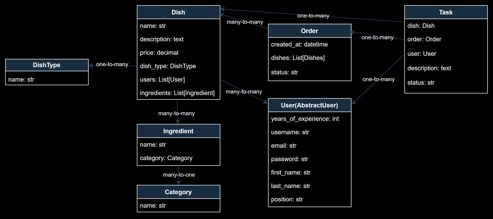

# Restaurant kitchen service project

Management system in which chefs can create new dishes and their types, as well as designate chefs responsible for preparing each dish

## Check it out

* You can use these data(Login: Rostik, Password: Dd1234567!) to login
* Or create your own user
* https://restaurant-kitchen-service-np6a.onrender.com/

## Installation

```shell
git clone https://github.com/Dogober/restaurant-kitchen-service
cd restaurant-kitchen-service
python3 -m venv venv
source venv/bin/activate
pip -r install requirements.txt
```

## To run the project

```shell
python manage.py runserver
```

## Features

* Authentication and registration functionality for User (staff member)
* Managing dish, order, dish_type, category, user, task, ingredient directly via website interface
* Powerful admin-panel with advanced settings

## Not implemented features

* Create the tests
* Logic for waiter (only this one can create orders, but this staff member can do CRUD operations exactly with order not with something else)
* Filters

## Diagram


